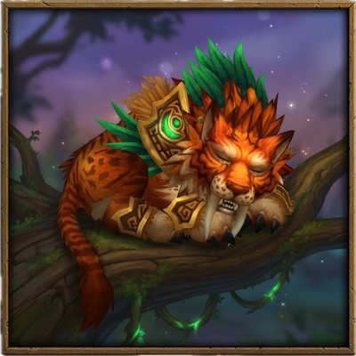

# BigBreak

A simple break timer for World of Warcraft with DBM and BigWigs interop.

## Features

- Color-coded countdown bar
- Persists across /reload
- Right-click bar to cancel

## How To Use

1. Type `/break 5` to start a 5-minute break timer
2. All BigBreak, DBM, and BigWigs users in your group will see the timer
3. Type `/break 0` to cancel, or right-click the bar
4. Type `/bb` to open settings

## Install

Install via [CurseForge](https://www.curseforge.com/wow/addons/bigbreak), or copy the `BigBreak` folder into your `Interface/AddOns/` directory.
